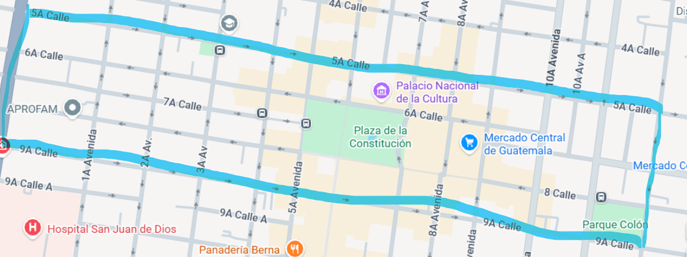

# Proyecto de Algoritmia: Búsqueda de la Ruta Más Corta

## Descripción General

Este proyecto es una implementación del algoritmo de Dijkstra para encontrar la ruta más corta entre dos puntos en un grafo. El sistema modela un mapa de una sección de una ciudad como un grafo dirigido, donde las intersecciones son nodos y las calles son aristas con pesos que representan la distancia. La aplicación principal permite a los usuarios visualizar el mapa, seleccionar puntos de origen y destino, y calcular la ruta óptima, considerando también escenarios con paradas intermedias, obstáculos o condiciones de tráfico.

## Visualización del Grafo

A continuación se muestra el mapa original y su representación como un grafo de nodos y aristas.

**Mapa Base:**


**Grafo del Mapa:**


## Fundamento Teórico: Algoritmo de Dijkstra

El algoritmo de Dijkstra es un algoritmo clásico utilizado para encontrar los caminos más cortos desde un nodo de origen a todos los demás nodos en un grafo ponderado, donde los pesos de las aristas no son negativos.

### Funcionamiento Matemático

1.  **Inicialización:**
    *   Se crea un conjunto de distancias, asignando un valor de 0 al nodo inicial y un valor de infinito (∞) a todos los demás nodos.
    *   Se crea un conjunto de nodos no visitados, que inicialmente contiene a todos los nodos del grafo.

2.  **Iteración:**
    *   Mientras el conjunto de nodos no visitados no esté vacío, se selecciona el nodo no visitado con la distancia más pequeña (el nodo "actual").
    *   Para el nodo actual, se consideran todos sus vecinos no visitados.
    *   Para cada vecino, se calcula la distancia desde el nodo de origen hasta ese vecino a través del nodo actual.
    *   Si la distancia recién calculada es menor que la distancia conocida para ese vecino, se actualiza la distancia del vecino.

3.  **Finalización:**
    *   Una vez que un nodo ha sido visitado (es decir, se ha convertido en el nodo "actual"), se marca como visitado y no se vuelve a seleccionar.
    *   El algoritmo termina cuando todos los nodos alcanzables han sido visitados. El resultado es un árbol de caminos más cortos desde el nodo de origen.

La eficiencia del algoritmo a menudo se mejora utilizando una cola de prioridad para seleccionar el nodo no visitado con la distancia mínima en cada paso.

## Características de la Implementación

*   **Backend:** Python.
*   **Modelado del Grafo:** Se utiliza la librería `networkx` para crear, manipular y analizar el grafo dirigido que representa el mapa.
*   **Interfaz de Usuario:**
    *   Una versión de consola (`main.py`) que permite calcular rutas directamente en el terminal.
    *   Una aplicación web interactiva (`path_show/app.py`) construida con el microframework `Flask`.
*   **Visualización Interactiva:** La interfaz web utiliza la librería `vis.js` para renderizar el grafo, permitiendo una visualización clara de los nodos, aristas y la ruta calculada.
*   **Funcionalidades Avanzadas:**
    *   **Ruta Simple:** Calcula el camino más corto entre un origen y un destino.
    *   **Ruta con Parada:** Encuentra la ruta de A a B pasando por un punto intermedio C.
    *   **Ruta con Obstáculo:** Recalcula la ruta óptima evitando un nodo específico (considerado un obstáculo).
    *   **Simulación de Tráfico:** Permite aplicar factores de ponderación a ciertas aristas para simular condiciones de tráfico ligero o pesado, afectando el cálculo de la ruta.

## Guía de Instalación y Uso Local

Siga estos pasos para configurar y ejecutar el proyecto en su máquina local.

### Prerrequisitos

*   Python 3.x
*   Git

### Pasos de Instalación

1.  **Clonar el repositorio:**
    ```bash
    git clone <URL_DEL_REPOSITORIO>
    cd proyecto_algoritmia
    ```

2.  **Crear y activar un entorno virtual:**
    *   En Windows:
        ```bash
        python -m venv .venv
        .venv\Scripts\activate
        ```
    *   En macOS/Linux:
        ```bash
        python3 -m venv .venv
        source .venv/bin/activate
        ```

3.  **Instalar las dependencias:**
    Asegúrese de que su entorno virtual esté activado y luego ejecute:
    ```bash
    pip install -r requirements.txt
    ```

### Ejecución

El proyecto tiene dos modos de ejecución: una aplicación de consola y una aplicación web.

#### 1. Aplicación Web (Recomendado)

Esta es la forma principal de interactuar con la solución.

1.  Navegue al directorio de la aplicación web:
    ```bash
    cd path_show
    ```

2.  Inicie el servidor de Flask:
    ```bash
    flask run
    ```

3.  Abra su navegador web y vaya a la siguiente dirección:
    `http://127.0.0.1:5000`

#### 2. Aplicación de Consola

Para cálculos rápidos sin una interfaz gráfica.

1.  Asegúrese de estar en el directorio raíz del proyecto.
2.  Ejecute el script principal:
    ```bash
    python main.py
    ```
3.  Siga las instrucciones que aparecen en la terminal para seleccionar una opción y los puntos de la ruta.

## Manual de Operación (Aplicación Web)

1.  **Abrir la Aplicación:** Una vez que el servidor esté en funcionamiento, abra `http://127.0.0.1:5000` en su navegador.
2.  **Seleccionar Modo de Ruta:**
    *   **Ruta Simple:** Deje la selección en "Ruta Simple".
    *   **Ruta con Parada:** Seleccione "Ruta con Parada". Aparecerá un nuevo menú desplegable para elegir el punto de parada.
    *   **Ruta con Obstáculo:** Seleccione "Ruta con Obstáculo". Aparecerá un nuevo menú para elegir el nodo a evitar.
3.  **Elegir Puntos:**
    *   Utilice los menús desplegables "Origen" y "Destino" para seleccionar los puntos de inicio y fin de su ruta.
    *   Si aplica, seleccione el punto de "Parada" u "Obstáculo".
4.  **Simular Tráfico (Opcional):**
    *   Marque las casillas "Aplicar Tráfico Pesado" o "Aplicar Tráfico Ligero" para que el algoritmo considere estas condiciones al calcular la ruta. Los pesos de las aristas afectadas se incrementarán, simulando un mayor "costo" para transitarlas.
5.  **Calcular Ruta:**
    *   Haga clic en el botón "Calcular Ruta".
6.  **Ver Resultados:**
    *   El grafo en la pantalla se actualizará, resaltando en color la ruta más corta encontrada.
    *   Debajo del grafo, se mostrará la distancia total del recorrido en kilómetros y la secuencia de nodos que componen el camino.
